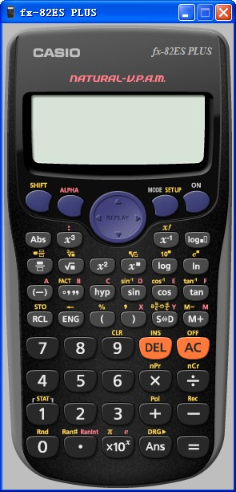

## 欢迎使用 fx-ES PLUS Easy Key Font Set 试验版本

LICENSE: GNU Public License v3

build by X230大青椒

[TOC]

*重要！*
本程序为试验版本，请大家多查找错误和漏洞。谢谢。

### 使用 fx-ES PLUS Easy Key Font Set

运行程序后，界面如下图所示。右边有一个喇叭图标，当按下时，计算器键盘按下会有声音。

点击一个按钮，进入计算器。选择不同的型号即可进入对应的计算器版本。如下图分别是 fx-85ES PLUS 和 fx-82ES PLUS 的模拟器。

<figure class="half"> </figure>

### 使用输出窗口

输出窗口会显示所有的键盘输出内容。

在计算器键盘上按下任意按钮后，就会弹出“输出”窗口。所有的按键过程都会记录到“输出”窗口中。

在“输出”窗口点击右键，显示快捷菜单：

其中：

* 点击“复制图像”，即可将图像组复制到剪贴板，在论坛上复制即可使用。
* 点击增加项目，可以手动增加按键项。
* 点击“删除项目”或按[DEL]，可以将选中项目删除。
* 点击“上下移动”，或按下 CTRL+↑↓，可以移动项目的位置。

